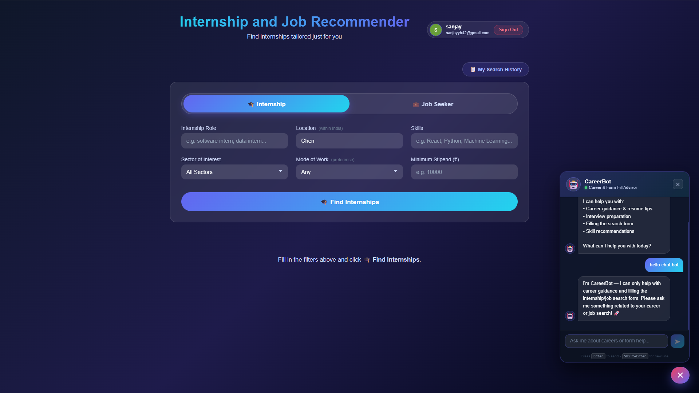

🚀 Internship & Job Recommender System

A scalable full-stack web application that delivers personalized internship and job recommendations using structured filtering and intelligent ranking logic.

📌 Problem Statement

Students often struggle to:

Find relevant internships quickly
Filter opportunities effectively
Match roles with their skills
Track previous searches

This project solves that by building a structured recommendation system that provides personalized, filter-driven job discovery with a clean and intuitive UX.

📸 Application Preview

✨ Key Features

🔍 Advanced Multi-Parameter Filtering
Supports filtering by role, skills, sector, stipend, and location to deliver highly relevant results.

📍 Location-Aware Search
Enables region-specific internship discovery (India-focused dataset).

🧠 Structured Recommendation Logic
Matches user skills with role requirements using rule-based ranking.

🤖 Integrated CareerBot Assistant
Provides guided assistance and career-related support within the application.

📜 Search History Tracking
Maintains previous search queries for improved user experience.

🔐 Secure Authentication
Implements protected routes and secure user access control.

⚡ Optimized & Responsive UI
Ensures fast performance and seamless experience across devices.

🏗 System Architecture
High-Level Flow
Client (React UI)
        ↓
REST API (Node/Express)
        ↓
Business Logic Layer
        ↓
Database (Structured Job Data)

Design Principles Used:

Separation of concerns
Modular backend structure
Scalable RESTful API design
Stateless authentication
Clean component-based frontend architecture

🛠 Tech Stack
Frontend-React.js,Tailwind CSS,Component-driven UI architecture

Backend-Node.js,Express.js,RESTful APIs

Database-MongoDB / Prisma ORM 

Tooling

Git
Postman
JWT Authentication

🧠 Recommendation Logic (Core Concept)

The system filters internships using:

Exact role matching

Partial skill keyword matching
Location-based narrowing
Stipend threshold filtering
Sector-based categorization

This mimics a simplified recommendation engine using structured rule-based logic.

⚙️ Installation
git clone https://github.com/sanjay-h42/Internship-Recommender-System.git
cd Internship-Recommender-System
npm install
npm run dev

📊 Scalability Considerations

Although built as a student project, the architecture allows:

Migration to microservices
Integration with external job APIs
Caching layer (Redis)
Asynchronous processing (Kafka)
AI-based ranking engine upgrade

🔒 Security Considerations

JWT-based authentication
Input validation
Protected routes
Sanitized query parameters

🚀 Future Improvements (Production-Ready Roadmap)

AI-powered ranking using embeddings
Resume parsing & skill extraction
Real-time job API integration
Admin analytics dashboard
Elasticsearch for advanced search
Distributed caching layer

📈 Engineering Impact

This project demonstrates:

Full-stack ownership
API design capability
Scalable thinking
Clean UI/UX implementation

Structured data filtering logic

Real-world problem solving
